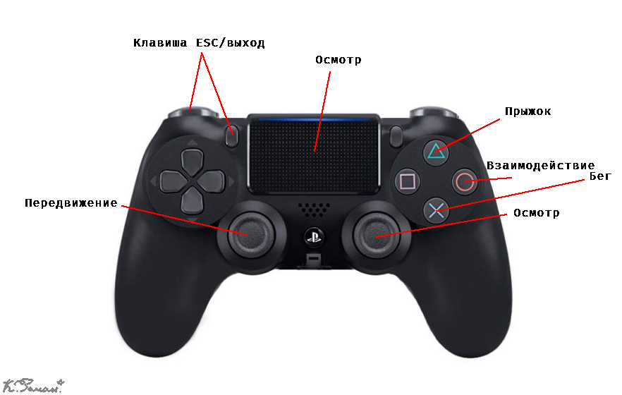

# The Igrik Parable / The Y Parable
Мой итоговый проект в 10 классе вдохновлённый [The Stanley Parable](https://store.steampowered.com/app/1703340/The_Stanley_Parable_Ultra_Deluxe)

## Главная идея игры:
Я решил пойти по образовательному подходу.
Персонажа зовут Игрик (во-первых потому что это математическая переменная а ещё потому что это имя схоже с "игрок", что даст чуть-чуть более чёткое представление о том кто это). 
Он будет в паре с рассказчиком рассказывать из чего состоят игры в развлекательной форме. 
Они находятся в незавершённой игре и диктор будет вести игрока через локации показывая как работают игры и объясняя концепты.

## Схема управления на геймпаде:

